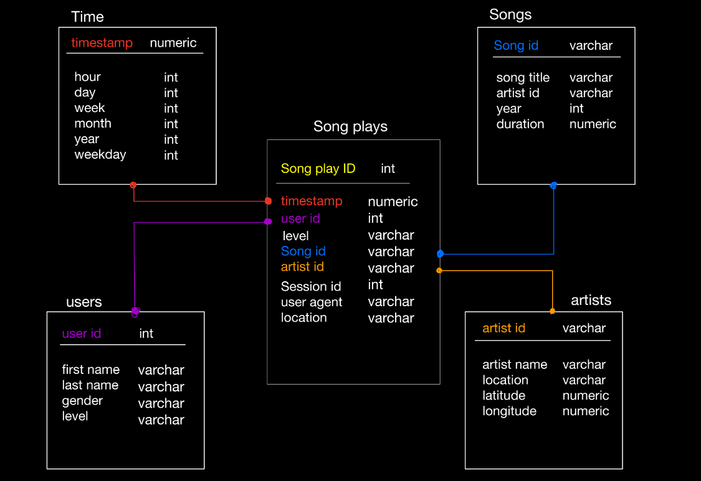

# Project: Data Modeling with Postgres
## Introduction
A startup called Sparkify wants to analyze the data they've been collecting on songs and user activity on their new music streaming app. The analytics team is particularly interested in understanding what songs users are listening to. Currently, they don't have an easy way to query their data, which resides in a directory of JSON logs on user activity on the app, as well as a directory with JSON metadata on the songs in their app.

They'd like a data engineer to create a Postgres database with tables designed to optimize queries on song play analysis, and bring you on the project. Your role is to create a database schema and ETL pipeline for this analysis. You'll be able to test your database and ETL pipeline by running queries given to you by the analytics team from Sparkify and compare your results with their expected results.

## Project Description
In this project, you'll apply what you've learned on data modeling with Postgres and build an ETL pipeline using Python. To complete the project, you will need to define fact and dimension tables for a star schema for a particular analytic focus, and write an ETL pipeline that transfers data from files in two local directories into these tables in Postgres using Python and SQL.

#### 1. Discuss the purpose of this database in the context of the startup, Sparkify, and their analytical goals.

Since the analytics team would like to understand what songs users are listening to, I need to give them an easy way to do that as a Data Engeineer. The JSON data should be extracted and put together in a way that makes the data readily available to the analytics team. This was done mainly using the Star Schema. 

#### 2. State and justify your database schema design and ETL pipeline.

The team needs to do fast aggregations on large amounts of data. For this reason, the Star Schema was chosen to be denormalized, as this allows for fast aggregations and simplified queries. The ETL pipeline is also there to move the data into the existing data model, which justifies its use. 

## File guide: 

#### 1. sql_queries.py 

This file Here constains all the SQL queries that will CREATE, INSERT, and SELECT from the Fact and Dimension tables.

#### 2. create_tables.py

This file will actually run the CREATE queries in **sql_queries.py** and create the fact and dimesion tables. They will however be empty at this stage

#### 3. etl.ipynb 

Here, a test run is made on the main ETL pipeline, just to see how the data in the SQL tables are being INSERTED. This is done through using pandas to manipulate the dataframes and observe them beforehand. 

#### 4. etl.py 

This file is the final file that runs the script on all the records, and inserting all the correct data into the fact/dimension tables. 

#### 5. test.ipynb

Use this file to select from the created tables and confirm that the work above has been done correctly. 
