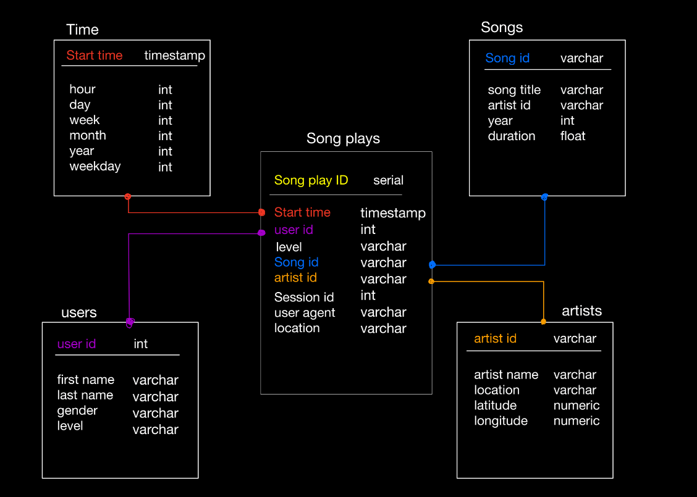

#Project: Data Pipelines with Airflow

## Introduction:
A music streaming company, Sparkify, has decided that it is time to introduce more 
automation and monitoring to their data warehouse ETL pipelines and come to the 
conclusion that the best tool to achieve this is Apache Airflow.

They have decided to bring a Data Engineer into the project and expect
high grade data pipelines that are dynamic and built from reusable tasks, can be 
monitored, and allow easy backfills. They have also noted that the data quality plays 
a big part when analyses are executed on top the data warehouse and want to run tests 
against their datasets after the ETL steps have been executed to catch any 
discrepancies in the datasets.

The source data resides in S3 and needs to be processed in Sparkify's data warehouse 
in Amazon Redshift. The source datasets consist of JSON logs that tell about user 
activity in the application and JSON metadata about the songs the users listen to.

## Project Overview:

The song and log data was to be placed in the following star schema: 



And therefore, the following DAG architecture was chosen: 


## Files: 

There are a lot of files that I've added into the project. 

#### Creating the S3 Bucket: 
1. Run the following files in this order: <br> 
a. **s3_files/create_s3.py** <br>
b. **s3_files/delete_s3.py** <br>
c. One should also create a config file in the following format: <br>
```
[AWS]
AWS_ACCESS_KEY_ID= <key>
AWS_SECRET_ACCESS_KEY= <secret>
```

#### Create Amazon Redshift cluster:
2. Run the following files in this order: <br> 
a. **redshift/create_redshift.py** (Create the cluster) <br>
b. **redshift/create_tables.py** (Create all the required tables) <br>
c. **redshift/redshift_status.py** (Check cluster status) <br>
d. **redshift/delete_redshift.py** (delete the cluster) <br>
e. **redshift/config_details.py** (Houses necessary config parsing functions) <br>
f. Please note that the config file should follow the following format, and be placed 
in the redshift folder: <br> 

```
[AWS]
key = <key>
secret = <secret>

[DWH]
dwh_cluster_type = <type string>
dwh_num_nodes = <int>
dwh_node_type = <node type>
dwh_iam_role_name = <name> 
dwh_cluster_identifier = <identifier>
dwh_db = <db>
dwh_db_user = <user>
dwh_db_password = <password>
dwh_port = <port>
dwh_endpoint = <endpoint> ## Generated automatically by the create redshift file 

```

#### Creating the dag

The files regarding the dag are present in the following manner: 

1. The DAG is located in **airflow/dags/udac_example_dag.py**
2. The operators used were the following: <br>
a. **airflow/plugins/operators/stage_redshift.py** (Copy from s3 to redshift)<br>
b. **airflow/plugins/operators/load_dimension.py** (Insert into the dimension tables)<br>
c. **airflow/plugins/operators/load_fact.py** (Insert into the facts tables) <br>
d. **airflow/plugins/operators/data_quality.py** (Perform a basic data quality check)<br>

#### Supplementary files: 

- **airflow/plugins/helpers/sql_queries.py**
- **create_tables.sql**


 

